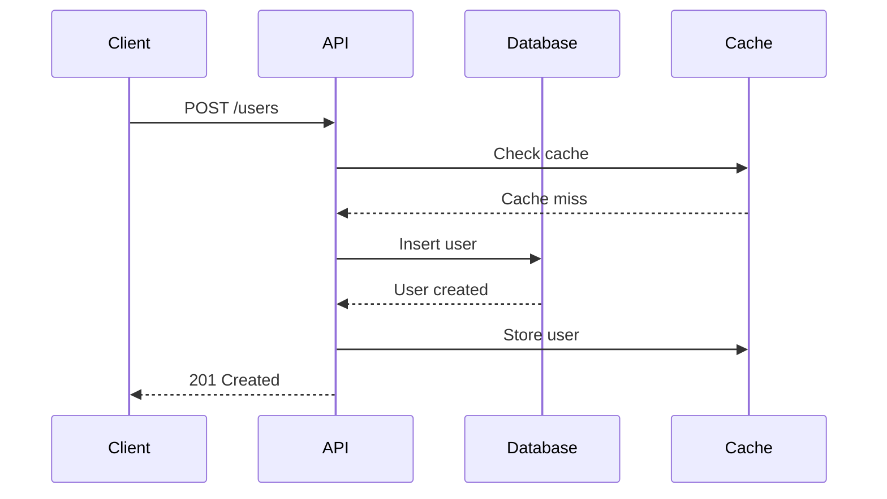
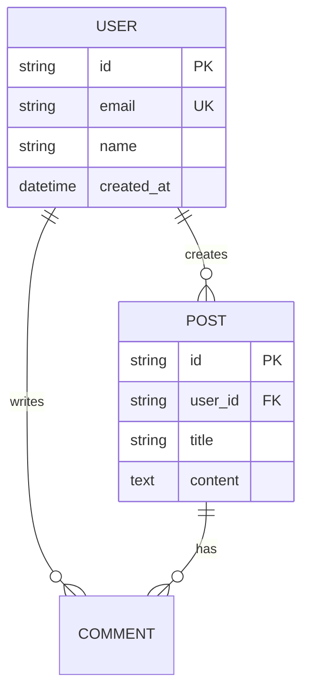

# Spec Compliance Review

---

## Two-Stage Review Architecture

```
                    ┌─────────────────────┐
                    │   Implementation    │
                    └──────────┬──────────┘
                               │
                    ┌──────────▼──────────┐
                    │  STAGE 1: Spec      │
                    │  Compliance Review  │
                    └──────────┬──────────┘
                               │
              ┌────────────────┴────────────────┐
              │                                  │
      ┌───────▼───────┐                ┌────────▼────────┐
      │   ✗ Issues    │                │   ✓ Compliant   │
      │     Found     │                │                 │
      └───────┬───────┘                └────────┬────────┘
              │                                  │
              │                        ┌────────▼────────┐
              │                        │  STAGE 2: Code  │
              │                        │  Quality Review │
              │                        └────────┬────────┘
              │                                  │
              │                    ┌─────────────┴─────────────┐
              │                    │                           │
              │            ┌───────▼───────┐         ┌────────▼────────┐
              │            │   ✗ Issues    │         │   ✓ Approved    │
              │            │     Found     │         │                 │
              │            └───────┬───────┘         └─────────────────┘
              │                    │
              └────────────────────┴────────────────────┐
                                                        │
                                              ┌─────────▼─────────┐
                                              │ Return to Author  │
                                              └───────────────────┘
```

**Critical:** Complete Stage 1 (spec compliance) BEFORE Stage 2 (code quality). Never review code quality for functionality that doesn't meet the specification.

---

## Stage 1: Spec Compliance Review

### Core Directive

> "The implementer finished suspiciously quickly. Their report may be incomplete, inaccurate, or optimistic."

Approach every review with professional skepticism. Verify claims independently.

### The Three Verification Categories

#### Category 1: Missing Requirements

**Check for features that were requested but not implemented.**

| Question | How to Verify |
|----------|---------------|
| Did they skip requested features? | Compare PR to original requirements line by line |
| Are edge cases handled? | Check error paths, empty states, boundaries |
| Were error scenarios addressed? | Look for try/catch, error boundaries, validation |
| Is the happy path complete? | Trace through primary use case manually |

```markdown
## Example Review Finding

**Missing Requirement:** Issue #42 requested "password must be at least 8 characters"

**Found in code:**
```typescript
// No length validation present
function validatePassword(password: string) {
  return password.length > 0;  // Only checks non-empty
}
```

**Status:** ❌ Incomplete - minimum length validation missing
```

#### Category 2: Unnecessary Additions

**Check for scope creep and over-engineering.**

| Question | How to Verify |
|----------|---------------|
| Features beyond specification? | Compare to original requirements |
| Over-engineering? | Is complexity justified by requirements? |
| Premature optimization? | Is performance cited without measurements? |
| Unrequested abstractions? | Are there helpers/utils for one-time use? |

```markdown
## Example Review Finding

**Unnecessary Addition:** Added caching layer not in requirements

**Found in code:**
```typescript
// Original requirement: "Fetch user by ID"
// Actual implementation:
class CachedUserRepository {  // Not requested
  private cache = new Map();
  private ttl = 60000;

  async getUser(id: string) {
    if (this.cache.has(id)) { ... }
    // 50 lines of cache logic
  }
}
```

**Status:** ⚠️ Scope creep - discuss before merging
```

#### Category 3: Interpretation Gaps

**Check for misunderstandings of requirements.**

| Question | How to Verify |
|----------|---------------|
| Different understanding of requirements? | Ask author to explain their interpretation |
| Unclarified assumptions? | Look for comments like "assuming..." |
| Ambiguous specs resolved incorrectly? | Compare to similar existing features |

```markdown
## Example Review Finding

**Interpretation Gap:** "Sort by date" implemented as ascending

**Requirement stated:** "Sort by date" (ambiguous)

**Author implemented:** Oldest first (ascending)

**Expected:** Most recent first is typical UX pattern

**Status:** ❓ Clarify - which sort order was intended?
```

---

## Why Order Matters

### Stage 1 Must Come First

| Scenario | Waste from Wrong Order |
|----------|------------------------|
| Skip Stage 1 | Review 500 lines of code quality, then discover wrong feature was built |
| Stage 2 First | Suggest refactoring, then realize the code shouldn't exist |
| Combined | Mix concerns, miss systematic issues |

### Separation of Concerns

- **Stage 1 (Spec):** Does it do the right thing?
- **Stage 2 (Quality):** Does it do the thing right?

Code quality review is meaningless if the code doesn't implement the correct functionality.

---

## Spec Compliance Checklist

### Before You Start

- [ ] Read the original issue/ticket completely
- [ ] Identify all explicit requirements
- [ ] Identify implicit requirements from context
- [ ] Note any acceptance criteria listed

### During Review

**Missing Requirements:**
- [ ] All required features present
- [ ] Edge cases covered (empty, null, max values)
- [ ] Error handling as specified
- [ ] Happy path fully functional
- [ ] UI matches mockups/specs if provided

**Unnecessary Additions:**
- [ ] No unrequested features
- [ ] No speculative abstractions
- [ ] No premature optimizations
- [ ] Scope matches requirements exactly

**Interpretation Gaps:**
- [ ] Author's understanding matches spec
- [ ] Ambiguities resolved correctly
- [ ] Assumptions are documented and valid
- [ ] Behavior matches similar existing features

### After Review

- [ ] Document all findings with file:line references
- [ ] Categorize as missing/unnecessary/interpretation
- [ ] Prioritize: blocking vs. non-blocking issues

---

## Output Format

### Compliant Result

```markdown
## Spec Compliance Review: ✅ PASS

All requirements verified:
- ✅ User can upload profile image (req #1)
- ✅ Image resized to 200x200 (req #2)
- ✅ Invalid formats rejected with error message (req #3)
- ✅ Progress indicator during upload (req #4)

**Proceed to:** Code Quality Review
```

### Issues Found

```markdown
## Spec Compliance Review: ❌ ISSUES FOUND

### Missing Requirements

1. **Progress indicator not implemented** (req #4)
   - File: `ProfileUpload.tsx`
   - Expected: Progress bar during upload
   - Found: No progress indication

2. **Error messages not user-friendly** (req #3)
   - File: `ProfileUpload.tsx:45`
   - Expected: "Please upload a JPG or PNG file"
   - Found: "Error: INVALID_FORMAT"

### Unnecessary Additions

1. **Image cropping feature not requested**
   - File: `ImageCropper.tsx` (new file, 150 lines)
   - Impact: Adds complexity, delays delivery
   - Recommendation: Remove or create separate PR

**Action Required:** Address missing requirements before code quality review
```

---

## Common Mistakes to Avoid

| Mistake | Why It's Wrong |
|---------|----------------|
| Reviewing code style before spec compliance | Wasted effort if wrong thing was built |
| Assuming spec was followed | Verify independently |
| Skipping edge cases | Bugs hide in boundaries |
| Accepting "we can add it later" | Technical debt accumulates |
| Missing scope creep | Unreviewed code enters codebase |

---

*Content adapted from [obra/superpowers](https://github.com/obra/superpowers) by Jesse Vincent (@obra), MIT License.*

# API Documentation: FastAPI & Django

## FastAPI (Auto-generates from types)

FastAPI automatically generates OpenAPI documentation from type hints and docstrings.

### Endpoint Documentation

```python
from fastapi import FastAPI, HTTPException, status
from pydantic import BaseModel, Field

class UserCreate(BaseModel):
    """User creation request body."""

    name: str = Field(..., min_length=1, max_length=100, example="John Doe")
    email: str = Field(..., example="john@example.com")

class UserResponse(BaseModel):
    """User response with generated ID."""

    id: int = Field(..., example=1)
    name: str
    email: str

@app.post(
    "/users",
    response_model=UserResponse,
    status_code=status.HTTP_201_CREATED,
    summary="Create a new user",
    tags=["Users"],
)
async def create_user(user: UserCreate) -> UserResponse:
    """Create a new user account.

    Args:
        user: User creation data including name and email.

    Returns:
        Created user with generated ID.

    Raises:
        HTTPException: 400 if email already exists.
    """
```

### Router with Tags

```python
from fastapi import APIRouter

router = APIRouter(
    prefix="/users",
    tags=["Users"],
    responses={404: {"description": "Not found"}},
)

@router.get(
    "/{user_id}",
    response_model=UserResponse,
    summary="Get user by ID",
)
async def get_user(user_id: int) -> UserResponse:
    """Retrieve a user by their unique identifier."""
```

## Django REST Framework (drf-spectacular)

### ViewSet Documentation

```python
from rest_framework import viewsets, status
from rest_framework.decorators import action
from drf_spectacular.utils import extend_schema, OpenApiParameter

class UserViewSet(viewsets.ModelViewSet):
    """
    ViewSet for managing user accounts.

    list: Get all users with pagination.
    create: Create a new user account.
    retrieve: Get a specific user by ID.
    update: Update all user fields.
    partial_update: Update specific user fields.
    destroy: Delete a user account.
    """

    queryset = User.objects.all()
    serializer_class = UserSerializer

    @extend_schema(
        summary="Get current user",
        description="Returns the authenticated user's profile",
        responses={200: UserSerializer},
    )
    @action(detail=False, methods=["get"])
    def me(self, request):
        """Get the authenticated user's profile."""
        serializer = self.get_serializer(request.user)
        return Response(serializer.data)
```

### Serializer Documentation

```python
from rest_framework import serializers

class UserSerializer(serializers.ModelSerializer):
    """Serializer for user model with validation."""

    class Meta:
        model = User
        fields = ["id", "name", "email", "created_at"]
        read_only_fields = ["id", "created_at"]

    name = serializers.CharField(
        help_text="User's display name",
        max_length=100,
    )
    email = serializers.EmailField(
        help_text="User's email address (unique)",
    )
```

### Custom Schema

```python
from drf_spectacular.utils import extend_schema, OpenApiExample

@extend_schema(
    request=UserCreateSerializer,
    responses={
        201: UserSerializer,
        400: OpenApiTypes.OBJECT,
    },
    examples=[
        OpenApiExample(
            "Valid request",
            value={"name": "John", "email": "john@example.com"},
        ),
    ],
)
def create(self, request):
    """Create a new user."""
```

## Quick Reference

| Framework | Documentation Source | Output |
|-----------|---------------------|--------|
| FastAPI | Type hints + docstrings | Auto Swagger UI |
| DRF | Serializers + drf-spectacular | Auto Swagger UI |

| FastAPI Decorator | Purpose |
|-------------------|---------|
| `summary` | Short endpoint description |
| `description` | Detailed description |
| `tags` | Group endpoints |
| `response_model` | Response schema |
| `responses` | Additional response codes |

| DRF Decorator | Purpose |
|---------------|---------|
| `@extend_schema` | Customize schema |
| `OpenApiParameter` | Query/path params |
| `OpenApiExample` | Request examples |

# API Documentation: FastAPI & Django

## FastAPI (Auto-generates from types)

FastAPI automatically generates OpenAPI documentation from type hints and docstrings.

### Endpoint Documentation

```python
from fastapi import FastAPI, HTTPException, status
from pydantic import BaseModel, Field

class UserCreate(BaseModel):
    """User creation request body."""

    name: str = Field(..., min_length=1, max_length=100, example="John Doe")
    email: str = Field(..., example="john@example.com")

class UserResponse(BaseModel):
    """User response with generated ID."""

    id: int = Field(..., example=1)
    name: str
    email: str

@app.post(
    "/users",
    response_model=UserResponse,
    status_code=status.HTTP_201_CREATED,
    summary="Create a new user",
    tags=["Users"],
)
async def create_user(user: UserCreate) -> UserResponse:
    """Create a new user account.

    Args:
        user: User creation data including name and email.

    Returns:
        Created user with generated ID.

    Raises:
        HTTPException: 400 if email already exists.
    """
```

### Router with Tags

```python
from fastapi import APIRouter

router = APIRouter(
    prefix="/users",
    tags=["Users"],
    responses={404: {"description": "Not found"}},
)

@router.get(
    "/{user_id}",
    response_model=UserResponse,
    summary="Get user by ID",
)
async def get_user(user_id: int) -> UserResponse:
    """Retrieve a user by their unique identifier."""
```

## Django REST Framework (drf-spectacular)

### ViewSet Documentation

```python
from rest_framework import viewsets, status
from rest_framework.decorators import action
from drf_spectacular.utils import extend_schema, OpenApiParameter

class UserViewSet(viewsets.ModelViewSet):
    """
    ViewSet for managing user accounts.

    list: Get all users with pagination.
    create: Create a new user account.
    retrieve: Get a specific user by ID.
    update: Update all user fields.
    partial_update: Update specific user fields.
    destroy: Delete a user account.
    """

    queryset = User.objects.all()
    serializer_class = UserSerializer

    @extend_schema(
        summary="Get current user",
        description="Returns the authenticated user's profile",
        responses={200: UserSerializer},
    )
    @action(detail=False, methods=["get"])
    def me(self, request):
        """Get the authenticated user's profile."""
        serializer = self.get_serializer(request.user)
        return Response(serializer.data)
```

### Serializer Documentation

```python
from rest_framework import serializers

class UserSerializer(serializers.ModelSerializer):
    """Serializer for user model with validation."""

    class Meta:
        model = User
        fields = ["id", "name", "email", "created_at"]
        read_only_fields = ["id", "created_at"]

    name = serializers.CharField(
        help_text="User's display name",
        max_length=100,
    )
    email = serializers.EmailField(
        help_text="User's email address (unique)",
    )
```

### Custom Schema

```python
from drf_spectacular.utils import extend_schema, OpenApiExample

@extend_schema(
    request=UserCreateSerializer,
    responses={
        201: UserSerializer,
        400: OpenApiTypes.OBJECT,
    },
    examples=[
        OpenApiExample(
            "Valid request",
            value={"name": "John", "email": "john@example.com"},
        ),
    ],
)
def create(self, request):
    """Create a new user."""
```

## Quick Reference

| Framework | Documentation Source | Output |
|-----------|---------------------|--------|
| FastAPI | Type hints + docstrings | Auto Swagger UI |
| DRF | Serializers + drf-spectacular | Auto Swagger UI |

| FastAPI Decorator | Purpose |
|-------------------|---------|
| `summary` | Short endpoint description |
| `description` | Detailed description |
| `tags` | Group endpoints |
| `response_model` | Response schema |
| `responses` | Additional response codes |

| DRF Decorator | Purpose |
|---------------|---------|
| `@extend_schema` | Customize schema |
| `OpenApiParameter` | Query/path params |
| `OpenApiExample` | Request examples |

# API Documentation: NestJS & Express

## NestJS (@nestjs/swagger)

NestJS requires explicit decorators for OpenAPI documentation.

### Controller Documentation

```typescript
import { Controller, Post, Body, Get, Param } from '@nestjs/common';
import {
  ApiTags,
  ApiOperation,
  ApiResponse,
  ApiParam,
  ApiBearerAuth,
} from '@nestjs/swagger';

@ApiTags('Users')
@ApiBearerAuth()
@Controller('users')
export class UsersController {
  @Post()
  @ApiOperation({ summary: 'Create a new user' })
  @ApiResponse({
    status: 201,
    description: 'User created successfully',
    type: UserDto,
  })
  @ApiResponse({
    status: 400,
    description: 'Invalid input data',
  })
  async create(@Body() dto: CreateUserDto): Promise<UserDto> {
    return this.usersService.create(dto);
  }

  @Get(':id')
  @ApiOperation({ summary: 'Get user by ID' })
  @ApiParam({
    name: 'id',
    description: 'User unique identifier',
    example: '123',
  })
  @ApiResponse({ status: 200, type: UserDto })
  @ApiResponse({ status: 404, description: 'User not found' })
  async findOne(@Param('id') id: string): Promise<UserDto> {
    return this.usersService.findOne(id);
  }
}
```

### DTO Documentation

```typescript
import { ApiProperty, ApiPropertyOptional } from '@nestjs/swagger';
import { IsEmail, IsString, MinLength } from 'class-validator';

export class CreateUserDto {
  @ApiProperty({
    description: "User's display name",
    example: 'John Doe',
    minLength: 1,
    maxLength: 100,
  })
  @IsString()
  @MinLength(1)
  name: string;

  @ApiProperty({
    description: "User's email address",
    example: 'john@example.com',
  })
  @IsEmail()
  email: string;

  @ApiPropertyOptional({
    description: 'Profile picture URL',
    example: 'https://example.com/avatar.jpg',
  })
  avatarUrl?: string;
}
```

## Express (swagger-jsdoc)

Express uses JSDoc comments with swagger annotations.

### Setup

```javascript
const swaggerJsdoc = require('swagger-jsdoc');
const swaggerUi = require('swagger-ui-express');

const options = {
  definition: {
    openapi: '3.0.0',
    info: {
      title: 'API Documentation',
      version: '1.0.0',
    },
  },
  apis: ['./routes/*.js'],
};

const specs = swaggerJsdoc(options);
app.use('/api-docs', swaggerUi.serve, swaggerUi.setup(specs));
```

### Route Documentation

```javascript
/**
 * @swagger
 * /users:
 *   post:
 *     summary: Create a new user
 *     tags: [Users]
 *     requestBody:
 *       required: true
 *       content:
 *         application/json:
 *           schema:
 *             $ref: '#/components/schemas/CreateUser'
 *     responses:
 *       201:
 *         description: User created successfully
 *         content:
 *           application/json:
 *             schema:
 *               $ref: '#/components/schemas/User'
 *       400:
 *         description: Invalid input
 */
router.post('/users', createUser);

/**
 * @swagger
 * /users/{id}:
 *   get:
 *     summary: Get user by ID
 *     tags: [Users]
 *     parameters:
 *       - in: path
 *         name: id
 *         required: true
 *         schema:
 *           type: string
 *         description: User ID
 *     responses:
 *       200:
 *         description: User found
 *         content:
 *           application/json:
 *             schema:
 *               $ref: '#/components/schemas/User'
 *       404:
 *         description: User not found
 */
router.get('/users/:id', getUser);
```

### Schema Documentation

```javascript
/**
 * @swagger
 * components:
 *   schemas:
 *     CreateUser:
 *       type: object
 *       required:
 *         - name
 *         - email
 *       properties:
 *         name:
 *           type: string
 *           description: User's display name
 *           example: John Doe
 *         email:
 *           type: string
 *           format: email
 *           description: User's email address
 *           example: john@example.com
 *     User:
 *       allOf:
 *         - $ref: '#/components/schemas/CreateUser'
 *         - type: object
 *           properties:
 *             id:
 *               type: string
 *               description: Unique identifier
 *             createdAt:
 *               type: string
 *               format: date-time
 */
```

## Quick Reference

| NestJS Decorator | Purpose |
|------------------|---------|
| `@ApiTags()` | Group endpoints |
| `@ApiOperation()` | Endpoint summary |
| `@ApiResponse()` | Response documentation |
| `@ApiParam()` | Path parameter |
| `@ApiQuery()` | Query parameter |
| `@ApiBody()` | Request body |
| `@ApiBearerAuth()` | Auth requirement |
| `@ApiProperty()` | DTO property |

| Express swagger-jsdoc | Purpose |
|-----------------------|---------|
| `@swagger` | Start swagger block |
| `tags` | Group endpoints |
| `summary` | Short description |
| `parameters` | Path/query params |
| `requestBody` | Request body schema |
| `responses` | Response schemas |
| `$ref` | Reference schema |

# Coverage Reports

## Documentation Coverage Report Template

```markdown
# Documentation Report: {project_name}

## Summary
- **Files analyzed**: 45
- **Functions documented**: 120/150 (80%)
- **Classes documented**: 25/25 (100%)
- **API endpoints documented**: 30/30 (100%)

## Coverage Before/After
- Before: 45%
- After: 92%

## Files Modified

| File | Functions Added | Notes |
|------|-----------------|-------|
| src/services/user.ts | 8 | All public methods |
| src/services/auth.ts | 5 | Added examples |
| src/controllers/users.ts | 6 | Added @Api decorators |
| src/dto/user.dto.ts | 4 | Added @ApiProperty |

## API Documentation

- **Framework**: NestJS
- **Strategy**: @nestjs/swagger decorators
- **Swagger UI**: /api/docs
- **OpenAPI spec**: /api-json

## Documentation Style

- **Python**: Google style docstrings
- **TypeScript**: JSDoc with @param, @returns
- **API**: OpenAPI 3.0 via decorators

## Next Steps

### Recommendations
1. Run `npm run docs:lint` to validate JSDoc
2. Add `eslint-plugin-jsdoc` to enforce documentation
3. Consider adding examples for complex functions
4. Set up documentation CI checks

### Missing Documentation
| File | Missing | Priority |
|------|---------|----------|
| src/utils/crypto.ts | 3 functions | High |
| src/helpers/date.ts | 2 functions | Medium |

### CI Integration
```yaml
# Add to CI pipeline
- name: Check documentation
  run: npm run docs:check

- name: Generate API docs
  run: npm run docs:generate
```
```

## Checklist During Documentation

```markdown
## Documentation Checklist

### Before Starting
- [ ] Confirmed format preference (Google/JSDoc/etc.)
- [ ] Identified files to exclude (tests, generated)
- [ ] Detected framework for API docs

### Functions/Methods
- [ ] All public functions documented
- [ ] Parameters described with types
- [ ] Return values documented
- [ ] Exceptions/errors documented
- [ ] Examples added for complex functions

### Classes
- [ ] Class purpose described
- [ ] Constructor parameters documented
- [ ] Public methods documented
- [ ] Important attributes explained

### API Endpoints
- [ ] All endpoints have summaries
- [ ] Request bodies documented
- [ ] Response schemas defined
- [ ] Error responses documented
- [ ] Authentication requirements noted

### Final Checks
- [ ] Ran documentation linter
- [ ] Verified Swagger UI renders correctly
- [ ] No inaccurate documentation
- [ ] Coverage report generated
```

## Framework-Specific Linting

```bash
# JavaScript/TypeScript - ESLint
npm install eslint-plugin-jsdoc --save-dev
# Add to .eslintrc: "plugins": ["jsdoc"]

# Python - pydocstyle
pip install pydocstyle
pydocstyle --convention=google src/

# Python - interrogate (coverage)
pip install interrogate
interrogate -v src/
```

## Quick Reference

| Metric | Good | Acceptable | Poor |
|--------|------|------------|------|
| Function coverage | >90% | 70-90% | <70% |
| Class coverage | 100% | >90% | <90% |
| API endpoint coverage | 100% | 100% | <100% |
| Example coverage | >50% | 30-50% | <30% |

# Documentation Systems & Infrastructure

## Static Site Generators

### Docusaurus (Meta)

```bash
# Setup
npx create-docusaurus@latest docs classic
cd docs && npm start

# Structure
docs/
├── docs/           # Documentation pages
├── blog/           # Blog posts
├── src/
│   └── pages/      # Custom pages
└── docusaurus.config.js
```

**docusaurus.config.js:**
```javascript
module.exports = {
  title: 'My API',
  tagline: 'Build amazing things',
  url: 'https://docs.example.com',
  baseUrl: '/',

  themeConfig: {
    navbar: {
      items: [
        {to: '/docs/intro', label: 'Docs', position: 'left'},
        {to: '/api', label: 'API', position: 'left'},
      ],
    },

    // Algolia search
    algolia: {
      apiKey: 'YOUR_API_KEY',
      indexName: 'your_index',
      contextualSearch: true,
    },

    prism: {
      theme: lightCodeTheme,
      darkTheme: darkCodeTheme,
      additionalLanguages: ['python', 'rust'],
    },
  },
};
```

### MkDocs (Python)

```yaml
# mkdocs.yml
site_name: My API Documentation
theme:
  name: material
  features:
    - navigation.tabs
    - navigation.sections
    - toc.integrate
    - search.suggest
    - search.highlight
  palette:
    - scheme: default
      toggle:
        icon: material/brightness-7
        name: Switch to dark mode
    - scheme: slate
      toggle:
        icon: material/brightness-4
        name: Switch to light mode

plugins:
  - search
  - mkdocstrings:
      handlers:
        python:
          options:
            show_source: true
  - git-revision-date-localized

markdown_extensions:
  - pymdownx.highlight
  - pymdownx.superfences
  - admonition
  - codehilite

nav:
  - Home: index.md
  - Getting Started: getting-started.md
  - API Reference: api/
```

### VitePress (Vue)

```typescript
// .vitepress/config.ts
export default defineConfig({
  title: 'API Docs',
  description: 'Developer documentation',

  themeConfig: {
    nav: [
      { text: 'Guide', link: '/guide/' },
      { text: 'API', link: '/api/' },
    ],

    sidebar: {
      '/guide/': [
        {
          text: 'Introduction',
          items: [
            { text: 'Getting Started', link: '/guide/getting-started' },
            { text: 'Configuration', link: '/guide/config' },
          ],
        },
      ],
    },

    search: {
      provider: 'local',
    },

    editLink: {
      pattern: 'https://github.com/user/repo/edit/main/docs/:path',
    },
  },
});
```

## Multi-Version Documentation

### Version Switcher

```javascript
// Docusaurus versions
{
  versions: {
    current: {
      label: '2.0 (Next)',
      path: 'next',
    },
  },
  onlyIncludeVersions: ['current', '1.5', '1.4'],
}
```

### Migration Guides

```markdown
# Migration Guide: v1 to v2

## Breaking Changes

### Authentication
**v1:**
```python
client.authenticate(api_key)
```

**v2:**
```python
client = Client(api_key=api_key)  # Pass in constructor
```

### Renamed Methods
| v1 | v2 | Notes |
|----|----|----- |
| `get_user()` | `fetch_user()` | Async now |
| `delete_user()` | `remove_user()` | Returns Promise |

## Deprecation Timeline
- v1.x: Supported until Dec 2025
- v2.0: Released Jan 2025
- v2.1: Current (June 2025)
```

## Search Implementation

### Algolia DocSearch

```html
<!-- Add to theme -->
<link rel="stylesheet" href="https://cdn.jsdelivr.net/npm/@docsearch/css@3" />

<script src="https://cdn.jsdelivr.net/npm/@docsearch/js@3"></script>
<script>
  docsearch({
    appId: 'YOUR_APP_ID',
    apiKey: 'YOUR_API_KEY',
    indexName: 'your_index',
    container: '#docsearch',
  });
</script>
```

### Local Search (Lunr.js)

```javascript
const idx = lunr(function() {
  this.ref('id');
  this.field('title', { boost: 10 });
  this.field('content');

  documents.forEach(doc => this.add(doc));
});

// Search
const results = idx.search('authentication');
```

## Documentation Testing

### Link Checking

```bash
# linkcheck (Python)
pip install linkchecker
linkchecker http://localhost:3000/docs

# broken-link-checker (Node)
npm install -g broken-link-checker
blc http://localhost:3000 -ro
```

### Code Example Testing

```python
# doctest for Python examples
"""
>>> add(2, 3)
5
>>> add(-1, 1)
0
"""

# Run tests
python -m doctest -v docs/*.md
```

```javascript
// Jest for TypeScript examples
// Extract code blocks and test
import { runExamples } from './test-docs';

test('API examples work', async () => {
  const examples = extractExamples('./docs/api.md');
  await expect(runExamples(examples)).resolves.toBeTruthy();
});
```

## Performance Optimization

### Build Optimization

```javascript
// Webpack/Vite config
export default {
  build: {
    rollupOptions: {
      output: {
        manualChunks: {
          'vendor': ['react', 'react-dom'],
        },
      },
    },
  },

  optimizeDeps: {
    include: ['prismjs'],
  },
};
```

### CDN & Caching

```nginx
# nginx.conf
location /docs {
  expires 1y;
  add_header Cache-Control "public, immutable";
}

location ~* \.(html)$ {
  expires 1h;
  add_header Cache-Control "public, must-revalidate";
}
```

## Analytics Integration

### Google Analytics

```javascript
// Docusaurus
gtag: {
  trackingID: 'G-XXXXXXXXXX',
  anonymizeIP: true,
},
```

### Custom Analytics

```javascript
// Track search queries
function trackSearch(query, results) {
  analytics.track('docs_search', {
    query,
    resultCount: results.length,
    timestamp: new Date(),
  });
}
```

## Quick Reference

| Tool | Best For | Tech Stack |
|------|----------|-----------|
| Docusaurus | React projects, versioning | React, MDX |
| MkDocs | Python projects, simple setup | Python, Jinja2 |
| VitePress | Vue projects, fast builds | Vue, Vite |
| Nextra | Next.js integration | React, Next.js |
| Mintlify | Modern UI, AI search | React |

| Search Solution | Cost | Features |
|----------------|------|----------|
| Algolia DocSearch | Free (OSS) | Fast, typo-tolerant |
| Local (Lunr.js) | Free | Offline, no server |
| Typesense | Free (self-host) | Privacy-focused |
| Meilisearch | Free (self-host) | Fast, relevance |

# Interactive API Documentation

## OpenAPI 3.1 Advanced Features

### Reusable Components

```yaml
openapi: 3.1.0
info:
  title: Users API
  version: 2.0.0

components:
  # Reusable schemas
  schemas:
    User:
      type: object
      required: [id, email]
      properties:
        id:
          type: string
          format: uuid
          example: "123e4567-e89b-12d3-a456-426614174000"
        email:
          type: string
          format: email
          example: "user@example.com"

    Error:
      type: object
      properties:
        code:
          type: string
        message:
          type: string
        details:
          type: object

    PaginatedResponse:
      type: object
      properties:
        data:
          type: array
          items: {}
        total:
          type: integer
        page:
          type: integer

  # Reusable parameters
  parameters:
    PageParam:
      name: page
      in: query
      schema:
        type: integer
        default: 1
        minimum: 1

    LimitParam:
      name: limit
      in: query
      schema:
        type: integer
        default: 20
        minimum: 1
        maximum: 100

  # Security schemes
  securitySchemes:
    BearerAuth:
      type: http
      scheme: bearer
      bearerFormat: JWT

    ApiKeyAuth:
      type: apiKey
      in: header
      name: X-API-Key

    OAuth2:
      type: oauth2
      flows:
        authorizationCode:
          authorizationUrl: https://api.example.com/oauth/authorize
          tokenUrl: https://api.example.com/oauth/token
          scopes:
            read:users: Read user data
            write:users: Modify user data

  # Reusable responses
  responses:
    NotFound:
      description: Resource not found
      content:
        application/json:
          schema:
            $ref: '#/components/schemas/Error'

    Unauthorized:
      description: Authentication required
      content:
        application/json:
          schema:
            $ref: '#/components/schemas/Error'

paths:
  /users:
    get:
      summary: List users
      parameters:
        - $ref: '#/components/parameters/PageParam'
        - $ref: '#/components/parameters/LimitParam'
      security:
        - BearerAuth: []
      responses:
        '200':
          description: Success
          content:
            application/json:
              schema:
                allOf:
                  - $ref: '#/components/schemas/PaginatedResponse'
                  - type: object
                    properties:
                      data:
                        type: array
                        items:
                          $ref: '#/components/schemas/User'
```

## Interactive Documentation Portals

### Swagger UI Customization

```javascript
// Custom Swagger UI
const swaggerUi = require('swagger-ui-express');
const swaggerDocument = require('./openapi.json');

const options = {
  customCss: '.swagger-ui .topbar { display: none }',
  customSiteTitle: "API Docs",
  customfavIcon: "/favicon.ico",
  swaggerOptions: {
    persistAuthorization: true,
    displayRequestDuration: true,
    filter: true,
    tryItOutEnabled: true,
    requestInterceptor: (req) => {
      req.headers['X-Custom-Header'] = 'value';
      return req;
    },
  },
};

app.use('/api-docs', swaggerUi.serve, swaggerUi.setup(swaggerDocument, options));
```

### Redoc (Modern Alternative)

```html
<!DOCTYPE html>
<html>
<head>
  <title>API Documentation</title>
  <link href="https://fonts.googleapis.com/css?family=Montserrat:300,400,700|Roboto:300,400,700" rel="stylesheet">
</head>
<body>
  <redoc spec-url='./openapi.yaml'
    hide-download-button
    required-props-first
    native-scrollbars
    theme='{
      "colors": {
        "primary": {
          "main": "#4285F4"
        }
      },
      "typography": {
        "fontSize": "16px",
        "fontFamily": "Roboto, sans-serif"
      }
    }'>
  </redoc>
  <script src="https://cdn.redoc.ly/redoc/latest/bundles/redoc.standalone.js"></script>
</body>
</html>
```

### Stoplight Elements

```javascript
import { API } from '@stoplight/elements';
import '@stoplight/elements/styles.min.css';

function App() {
  return (
    <API
      apiDescriptionUrl="./openapi.yaml"
      router="hash"
      layout="sidebar"
      tryItCredentialsPolicy="include"
    />
  );
}
```

## Multi-Protocol Documentation

### GraphQL Schema Documentation

```graphql
"""
User account in the system
"""
type User {
  """
  Unique user identifier
  """
  id: ID!

  """
  User's email address (unique)
  @example "user@example.com"
  """
  email: String!

  """
  Display name
  @example "John Doe"
  """
  name: String!

  """
  User's posts (paginated)
  """
  posts(
    """Number of items per page (max 100)"""
    limit: Int = 20
    """Page offset"""
    offset: Int = 0
  ): PostConnection!
}

type Query {
  """
  Fetch a user by ID
  """
  user(
    """User's unique identifier"""
    id: ID!
  ): User

  """
  Search users by name or email
  """
  searchUsers(
    """Search query"""
    query: String!
    """Maximum results to return"""
    limit: Int = 10
  ): [User!]!
}

type Mutation {
  """
  Create a new user account
  """
  createUser(
    """User creation input"""
    input: CreateUserInput!
  ): CreateUserPayload!
}

"""
Input for creating a user
"""
input CreateUserInput {
  """User's email address"""
  email: String!
  """Display name"""
  name: String!
}
```

**GraphQL Playground:**
```javascript
const { ApolloServer } = require('apollo-server');

const server = new ApolloServer({
  typeDefs,
  resolvers,
  introspection: true,  // Enable in dev
  playground: {
    settings: {
      'editor.theme': 'dark',
      'editor.fontSize': 14,
    },
  },
});
```

### WebSocket Protocol Documentation

```yaml
# AsyncAPI 2.0
asyncapi: 2.5.0
info:
  title: Chat WebSocket API
  version: 1.0.0
  description: Real-time chat messaging

channels:
  chat/{roomId}:
    parameters:
      roomId:
        description: Chat room identifier
        schema:
          type: string

    subscribe:
      summary: Receive messages
      message:
        oneOf:
          - $ref: '#/components/messages/ChatMessage'
          - $ref: '#/components/messages/UserJoined'

    publish:
      summary: Send a message
      message:
        $ref: '#/components/messages/ChatMessage'

components:
  messages:
    ChatMessage:
      name: message
      payload:
        type: object
        properties:
          userId:
            type: string
          content:
            type: string
          timestamp:
            type: string
            format: date-time

    UserJoined:
      name: userJoined
      payload:
        type: object
        properties:
          userId:
            type: string
          username:
            type: string
```

### gRPC Documentation

```protobuf
syntax = "proto3";

package users.v1;

// User service manages user accounts
service UserService {
  // Get a user by ID
  // Returns: User object or NOT_FOUND error
  rpc GetUser(GetUserRequest) returns (User) {}

  // List all users with pagination
  // Returns: Paginated list of users
  rpc ListUsers(ListUsersRequest) returns (ListUsersResponse) {}

  // Create a new user
  // Returns: Created user or ALREADY_EXISTS error
  rpc CreateUser(CreateUserRequest) returns (User) {}

  // Stream user updates in real-time
  // Returns: Stream of user update events
  rpc WatchUsers(WatchUsersRequest) returns (stream UserEvent) {}
}

// User account
message User {
  // Unique identifier
  string id = 1;

  // Email address (unique, required)
  string email = 2;

  // Display name
  string name = 3;

  // Account creation timestamp
  google.protobuf.Timestamp created_at = 4;
}
```

## SDK Documentation Strategies

### Multi-Language Examples

```markdown
# Create User

## Python
```python
from myapi import Client

client = Client(api_key="your_key")
user = client.users.create(
    name="John Doe",
    email="john@example.com"
)
print(user.id)
```

## TypeScript
```typescript
import { Client } from '@myapi/sdk';

const client = new Client({ apiKey: 'your_key' });
const user = await client.users.create({
  name: 'John Doe',
  email: 'john@example.com',
});
console.log(user.id);
```

## Go
```go
import "github.com/myapi/sdk-go"

client := sdk.NewClient("your_key")
user, err := client.Users.Create(ctx, &sdk.CreateUserInput{
    Name:  "John Doe",
    Email: "john@example.com",
})
if err != nil {
    log.Fatal(err)
}
fmt.Println(user.ID)
```

## Ruby
```ruby
require 'myapi'

client = MyAPI::Client.new(api_key: 'your_key')
user = client.users.create(
  name: 'John Doe',
  email: 'john@example.com'
)
puts user.id
```
```

### SDK Reference Template

```markdown
# Users SDK

## Installation
```bash
npm install @myapi/sdk
```

## Configuration
```typescript
import { Client } from '@myapi/sdk';

const client = new Client({
  apiKey: process.env.API_KEY,
  baseUrl: 'https://api.example.com',  // Optional
  timeout: 30000,  // Optional, default 30s
});
```

## Methods

### `client.users.create(data)`
Create a new user.

**Parameters:**
- `data.name` (string, required) - User's display name
- `data.email` (string, required) - User's email address

**Returns:** Promise<User>

**Throws:**
- `ValidationError` - Invalid input data
- `ConflictError` - Email already exists
- `AuthenticationError` - Invalid API key

**Example:**
```typescript
const user = await client.users.create({
  name: 'John Doe',
  email: 'john@example.com',
});
```

## Error Handling
```typescript
import { ValidationError, ConflictError } from '@myapi/sdk';

try {
  await client.users.create(data);
} catch (error) {
  if (error instanceof ValidationError) {
    console.error('Invalid data:', error.fields);
  } else if (error instanceof ConflictError) {
    console.error('User already exists');
  }
}
```
```

## Quick Reference

| Tool | Protocol | Features |
|------|----------|----------|
| Swagger UI | REST | Try-it-out, auth |
| Redoc | REST | Clean, responsive |
| Stoplight | REST | Modern, mock server |
| GraphQL Playground | GraphQL | Explorer, history |
| AsyncAPI Studio | WebSocket | Visual editor |
| grpcui | gRPC | Interactive console |

# Python Docstrings

## Google Style (Recommended)

```python
def calculate_total(items: list[Item], tax_rate: float = 0.0) -> float:
    """Calculate total cost including tax.

    Args:
        items: List of items to calculate total for.
        tax_rate: Tax rate as decimal (e.g., 0.08 for 8%).

    Returns:
        Total cost including tax.

    Raises:
        ValueError: If tax_rate is negative or items is empty.

    Example:
        >>> calculate_total([Item(10), Item(20)], 0.1)
        33.0
    """
```

## NumPy Style

```python
def calculate_total(items: list[Item], tax_rate: float = 0.0) -> float:
    """
    Calculate total cost including tax.

    Parameters
    ----------
    items : list[Item]
        List of items to calculate total for.
    tax_rate : float, optional
        Tax rate as decimal (e.g., 0.08 for 8%). Default is 0.0.

    Returns
    -------
    float
        Total cost including tax.

    Raises
    ------
    ValueError
        If tax_rate is negative or items is empty.

    Examples
    --------
    >>> calculate_total([Item(10), Item(20)], 0.1)
    33.0
    """
```

## Sphinx Style

```python
def calculate_total(items: list[Item], tax_rate: float = 0.0) -> float:
    """Calculate total cost including tax.

    :param items: List of items to calculate total for.
    :type items: list[Item]
    :param tax_rate: Tax rate as decimal (e.g., 0.08 for 8%).
    :type tax_rate: float
    :returns: Total cost including tax.
    :rtype: float
    :raises ValueError: If tax_rate is negative or items is empty.

    .. code-block:: python

        >>> calculate_total([Item(10), Item(20)], 0.1)
        33.0
    """
```

## Class Documentation

```python
class UserService:
    """Service for managing user operations.

    This service handles CRUD operations for users and
    integrates with the authentication system.

    Attributes:
        db: Database session for queries.
        cache: Redis client for caching.

    Example:
        >>> service = UserService(db, cache)
        >>> user = await service.create_user(data)
    """

    def __init__(self, db: AsyncSession, cache: Redis) -> None:
        """Initialize UserService.

        Args:
            db: Database session for queries.
            cache: Redis client for caching.
        """
```

## Quick Reference

| Style | Args Format | Returns Format |
|-------|-------------|----------------|
| Google | `Args:` block | `Returns:` block |
| NumPy | `Parameters` section | `Returns` section |
| Sphinx | `:param name:` | `:returns:` |

## Sections Available

| Section | Google | NumPy | Sphinx |
|---------|--------|-------|--------|
| Parameters | `Args:` | `Parameters` | `:param:` |
| Returns | `Returns:` | `Returns` | `:returns:` |
| Raises | `Raises:` | `Raises` | `:raises:` |
| Examples | `Example:` | `Examples` | `.. code-block::` |
| Notes | `Note:` | `Notes` | `.. note::` |
| Attributes | `Attributes:` | `Attributes` | `:ivar:` |

# User Guides & Tutorials

## Tutorial Structure

### Progressive Learning Path

```markdown
# Getting Started with API

## Prerequisites
Before you begin, ensure you have:
- [ ] Node.js 18+ installed
- [ ] An API key from your dashboard
- [ ] Basic knowledge of REST APIs

## Quick Start (5 minutes)

### 1. Install the SDK
```bash
npm install @myapi/sdk
```

### 2. Create Your First Request
```typescript
import { Client } from '@myapi/sdk';

const client = new Client({ apiKey: 'your_key' });
const users = await client.users.list();
console.log(users);
```

### 3. Verify It Works
Run the code and you should see a list of users.

**Expected output:**
```json
{
  "data": [
    { "id": "1", "name": "Alice" },
    { "id": "2", "name": "Bob" }
  ],
  "total": 2
}
```

## Next Steps
- [Authentication Guide](/docs/auth) - Learn about OAuth and API keys
- [Advanced Queries](/docs/queries) - Filtering, sorting, pagination
- [Error Handling](/docs/errors) - Handle errors gracefully
```

### Step-by-Step Tutorial

```markdown
# Tutorial: Building a User Dashboard

**What you'll learn:**
- Fetching user data from the API
- Handling pagination
- Displaying data in a table
- Adding real-time updates

**Time:** 30 minutes
**Level:** Intermediate

## Step 1: Set Up the Project

Create a new project:
```bash
mkdir user-dashboard
cd user-dashboard
npm init -y
npm install @myapi/sdk react
```

## Step 2: Fetch Users

Create `src/api/users.ts`:
```typescript
import { Client } from '@myapi/sdk';

const client = new Client({ apiKey: process.env.API_KEY });

export async function getUsers(page = 1, limit = 20) {
  const response = await client.users.list({ page, limit });
  return response;
}
```

**What's happening:**
1. We import the SDK client
2. Initialize it with our API key from environment
3. Create a helper function that fetches paginated users

## Step 3: Create the Component

Create `src/components/UserTable.tsx`:
```typescript
import { useState, useEffect } from 'react';
import { getUsers } from '../api/users';

export function UserTable() {
  const [users, setUsers] = useState([]);
  const [loading, setLoading] = useState(true);

  useEffect(() => {
    async function fetchData() {
      const data = await getUsers();
      setUsers(data.data);
      setLoading(false);
    }
    fetchData();
  }, []);

  if (loading) return <div>Loading...</div>;

  return (
    <table>
      <thead>
        <tr>
          <th>Name</th>
          <th>Email</th>
        </tr>
      </thead>
      <tbody>
        {users.map(user => (
          <tr key={user.id}>
            <td>{user.name}</td>
            <td>{user.email}</td>
          </tr>
        ))}
      </tbody>
    </table>
  );
}
```

## Step 4: Test It

Run your app:
```bash
npm run dev
```

You should see a table with user data.

## Checkpoint
At this point, you have:
- [x] Set up the SDK
- [x] Created an API helper
- [x] Built a user table component
- [ ] Added pagination
- [ ] Added real-time updates

## Next: Adding Pagination

[Continue to Step 5 →](/docs/tutorial/step-5)
```

## Information Architecture

### Content Hierarchy

```markdown
Documentation/
├── Getting Started/
│   ├── Quick Start (5 min)
│   ├── Installation
│   ├── Authentication
│   └── First Request
│
├── Guides/
│   ├── User Management
│   ├── File Uploads
│   ├── Webhooks
│   └── Rate Limiting
│
├── API Reference/
│   ├── Users API
│   ├── Files API
│   └── Webhooks API
│
├── SDK Documentation/
│   ├── Python SDK
│   ├── TypeScript SDK
│   └── Go SDK
│
├── Tutorials/
│   ├── Build a Dashboard (30 min)
│   ├── Integrate Authentication (45 min)
│   └── Real-time Sync (60 min)
│
└── Resources/
    ├── Troubleshooting
    ├── FAQ
    ├── Best Practices
    └── Migration Guides
```

## Writing Techniques

### Task-Based Writing

```markdown
# How to Upload a File

**Goal:** Upload an image file to your account storage

**Time:** 5 minutes

## Steps

### 1. Prepare the file
Get the file from user input or file system:
```typescript
const file = document.querySelector('input[type="file"]').files[0];
```

### 2. Create form data
```typescript
const formData = new FormData();
formData.append('file', file);
formData.append('folder', 'avatars');
```

### 3. Upload with the SDK
```typescript
const result = await client.files.upload(formData);
console.log('File URL:', result.url);
```

## Common Issues

**"File too large" error:**
Maximum file size is 10MB. Compress images before uploading.

**"Invalid file type" error:**
Only .jpg, .png, .gif are allowed. Check the file extension.

## Related
- [File API Reference](/api/files)
- [Handling Upload Progress](/guides/upload-progress)
```

### Progressive Disclosure

```markdown
# Authentication

## Basic: API Keys (Recommended for Getting Started)

API keys are the simplest way to authenticate.

```typescript
const client = new Client({ apiKey: 'your_key' });
```

**When to use:** Scripts, internal tools, testing

[Generate an API key →](/dashboard/api-keys)

<details>
<summary>Advanced: OAuth 2.0</summary>

For user-facing applications, use OAuth 2.0.

### Authorization Code Flow

1. Redirect user to authorization URL:
```typescript
const authUrl = client.oauth.getAuthUrl({
  redirectUri: 'https://yourapp.com/callback',
  scopes: ['read:users', 'write:users'],
});
window.location.href = authUrl;
```

2. Handle the callback:
```typescript
const code = new URLSearchParams(window.location.search).get('code');
const tokens = await client.oauth.exchangeCode(code);
```

3. Use the access token:
```typescript
const client = new Client({ accessToken: tokens.access_token });
```

[Full OAuth guide →](/guides/oauth)
</details>

<details>
<summary>Enterprise: JWT Tokens</summary>

For service-to-service authentication, use JWTs.

```typescript
const jwt = createJWT({
  issuer: 'your-service',
  subject: 'service-account-id',
  privateKey: process.env.PRIVATE_KEY,
});

const client = new Client({ jwt });
```

[JWT setup guide →](/guides/jwt)
</details>
```

## Visual Communication

### Diagram Integration

```markdown
# System Architecture

## Request Flow



## Data Model


```

### Screenshot Annotations

```markdown
# Dashboard Overview


**Key features:**

1. **Navigation** - Switch between sections
2. **API Key** - Copy your key (click to reveal)
3. **Usage Stats** - Current month's API calls
4. **Quick Actions** - Generate new key, view docs
5. **Recent Activity** - Last 10 API requests

## Creating Your First API Key

1. Click "Generate New Key" (highlighted in green)
2. Enter a description like "Production API"
3. Select permissions (default: all)
4. Click "Create"
5. **Important:** Copy the key immediately - it won't be shown again


```

## Troubleshooting Guides

### Problem-Solution Format

```markdown
# Troubleshooting

## Authentication Errors

### "Invalid API key"

**Symptoms:**
- 401 Unauthorized error
- Error message: "Invalid API key"

**Causes:**
1. API key was copied incorrectly (extra spaces)
2. API key was revoked
3. Using test key in production environment

**Solutions:**

**1. Verify the key:**
```bash
# Check for extra spaces
echo -n "$API_KEY" | wc -c  # Should be exactly 32 characters
```

**2. Regenerate the key:**
- Go to [dashboard](/dashboard)
- Click "Revoke & Regenerate"
- Update your environment variables

**3. Check environment:**
```typescript
console.log('Environment:', process.env.NODE_ENV);
console.log('API URL:', client.baseUrl);
```

**Still not working?**
[Contact support](/support) with your request ID from the error response.

---

### "Rate limit exceeded"

**Symptoms:**
- 429 Too Many Requests error
- Requests failing intermittently

**Immediate fix:**
Wait 60 seconds and retry.

**Long-term solutions:**

**1. Implement exponential backoff:**
```typescript
async function retryWithBackoff(fn, maxRetries = 3) {
  for (let i = 0; i < maxRetries; i++) {
    try {
      return await fn();
    } catch (error) {
      if (error.status === 429 && i < maxRetries - 1) {
        await sleep(Math.pow(2, i) * 1000);
        continue;
      }
      throw error;
    }
  }
}
```

**2. Batch requests:**
Instead of 100 individual requests, use batch endpoints.

**3. Upgrade your plan:**
[View plans](/pricing) - Higher tiers have increased limits.
```

## FAQ Section

```markdown
# Frequently Asked Questions

## General

### What's included in the free tier?
- 1,000 API requests/month
- 1GB storage
- Community support
- All core features

### How do I upgrade?
Click "Upgrade" in your [dashboard](/dashboard) and select a plan.

## Technical

### Can I use this in production?
Yes, the API is production-ready with 99.9% SLA on paid plans.

### What's the rate limit?
- Free: 10 requests/minute
- Pro: 100 requests/minute
- Enterprise: Custom limits

### Do you support webhooks?
Yes! See [Webhooks Guide](/guides/webhooks) for setup.

### Which regions are available?
Currently: US East, US West, EU Central, Asia Pacific.

## Billing

### How does billing work?
- Monthly subscription
- Pay-as-you-go for overages
- Cancel anytime

### What payment methods do you accept?
Credit card, PayPal, wire transfer (annual plans only).

---

**Can't find your answer?**
- [Browse all docs](/docs)
- [Ask the community](https://community.example.com)
- [Contact support](/support)
```

## Quick Reference

| Content Type | Best For | Key Elements |
|-------------|----------|-------------|
| Quick Start | New users (5 min) | Prerequisites, minimal code, verify |
| Tutorial | Learning by doing | Steps, checkpoints, working code |
| How-To Guide | Specific tasks | Goal, steps, troubleshooting |
| Reference | Looking up details | Comprehensive, searchable |
| Explanation | Understanding concepts | Why, not how |

| Writing Principle | Technique |
|------------------|-----------|
| Clarity | Active voice, short sentences |
| Scannability | Headings, lists, code blocks |
| Completeness | Prerequisites, next steps, related links |
| Accuracy | Test all code, version specifics |